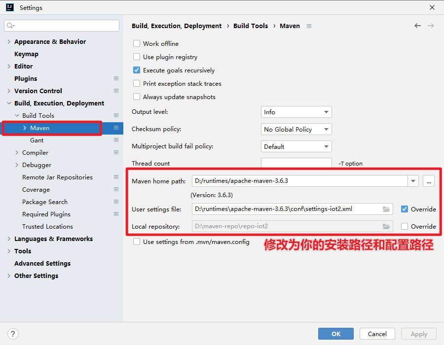
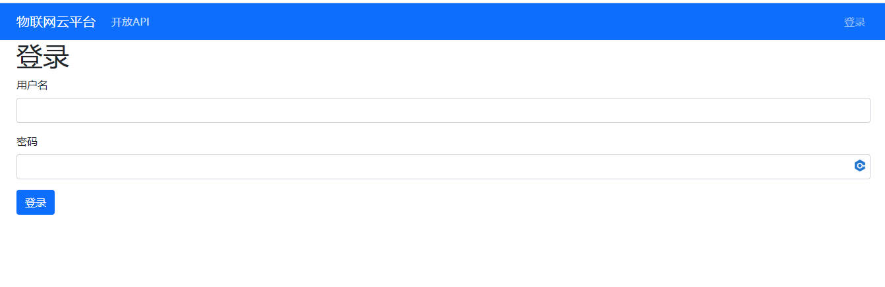

# iot-cloud

## 介绍
《物联网云平台设计与开发》云平台端

## 搭建和运行
1. 解压`iot-cloud-training-init.zip`项目，并使用 IDEA 打开项目。

2. 进入IDEA 菜单， `File`->`Settings`，修改为你的`Maven`的安装路径和`settings.xml`的路径。

3. 使用 HeidiSQL 运行脚本`src/main/resources/V000__CREATE_DB_AND_USER.sql`，创建数据库`iotcloudtr`、数据库用户和授权。

4. 利用 Flyway 进行数据迁移，按顺序执行 `src/main/resources/db/migration` 下的 SQL 脚本。创建的表如下描述：
- `device` 设备表
- `device_msg` 设备消息表
- `token` 用户令牌表
- `user` 用户表
- `dev_shadow_desire` 期望设备影子
- `dev_shadow_reported` 报告设备影子
- `flyway_schema_history` flyway执行历史记录表

5. 使用 HeidiSQL 访问数据库`iotcloudtr`，检查是否存在以上表。

6. 启动`IoTCloudApplication`，访问<a href="http://localhost:8098/" target="_blank"></a>。使用账号密码`zhangsan/123456`登录。

